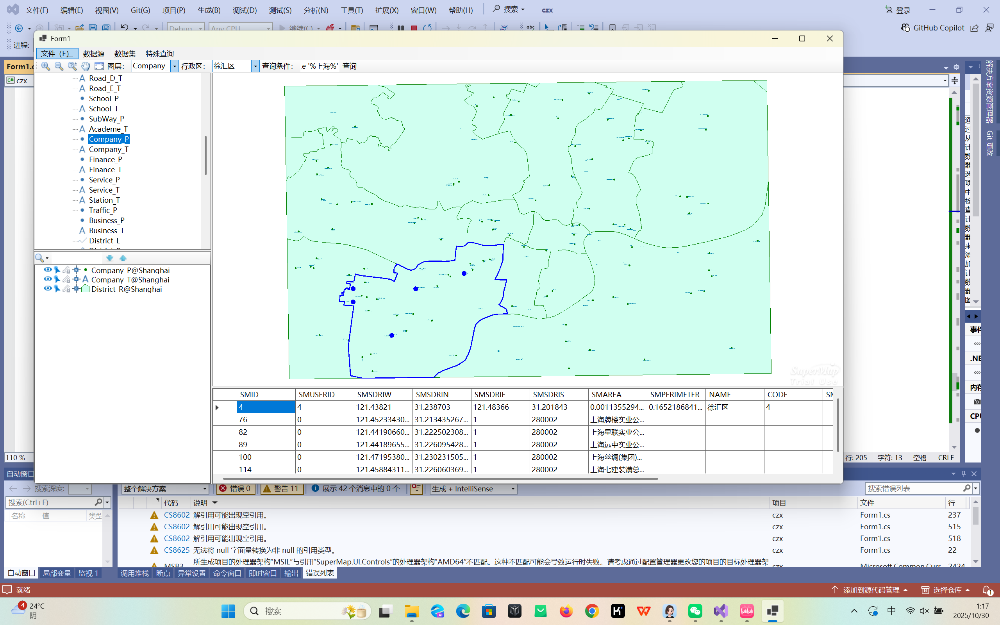
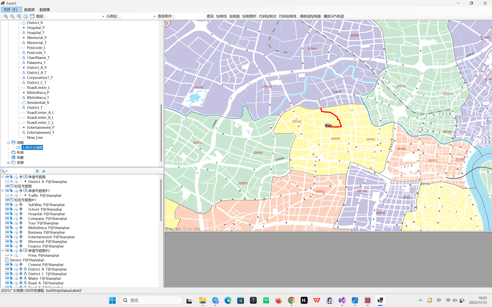
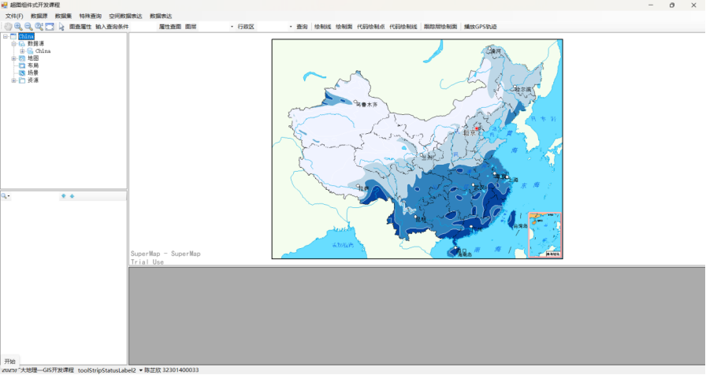
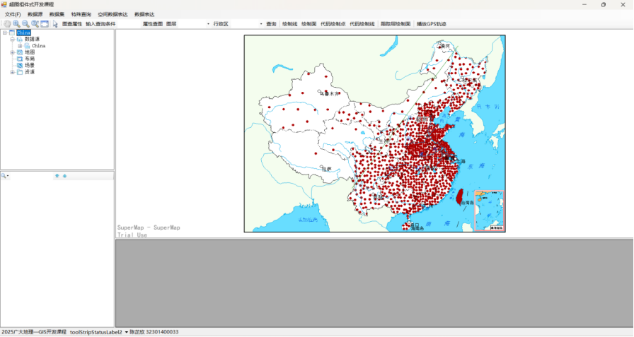
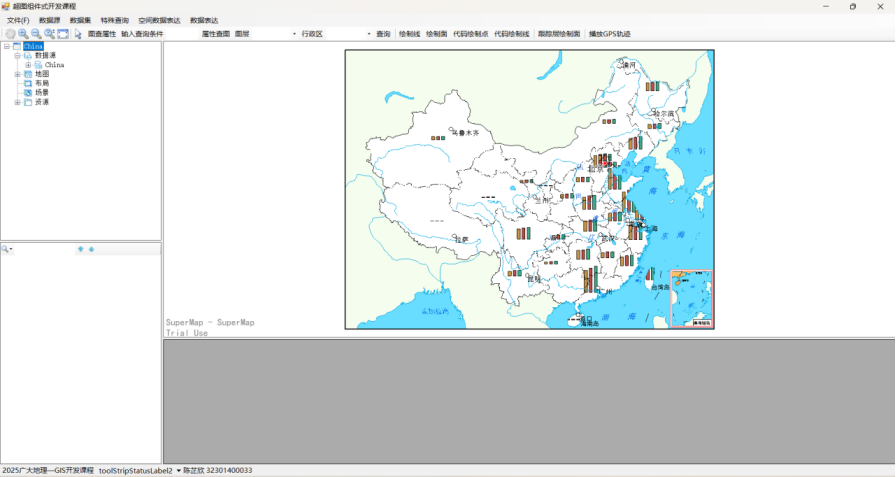

# 基于 SuperMap iObjects .NET 的 GIS 组件式开发与专题图可视化

## 项目简介

这是一个基于 **C#、Windows Forms 与 SuperMap iObjects .NET** 开发的桌面 GIS 应用项目，主要用于实践组件式 GIS 开发、空间数据查询、地图可视化、专题图制作与 GPS 轨迹处理。

项目围绕 GIS 数据访问与地图表达展开，包含属性查询、GPS 轨迹动态播放、分段专题图、点密度专题图和统计专题图等功能。

## 主要功能

- **属性查询**：实现 GIS 要素属性查询与查询结果交互。
- **GPS 轨迹播放**：读取 Excel GPS 数据并进行轨迹可视化与动态播放。
- **分段专题图**：根据属性字段进行分级设色，表达空间分布差异。
- **点密度专题图**：基于点数据制作点密度专题表达。
- **统计专题图**：结合属性统计结果制作统计专题图。
- **地图浏览与图层管理**：实现地图加载、图层组织及常用地图浏览操作。
- **空间数据操作**：使用 SuperMap 工作空间、数据源、数据集等组件进行 GIS 数据访问。
- **SQL Server 数据源连接**：提供 SQL Server 数据源连接与创建示例。

## 技术栈

| 技术 | 用途 |
|---|---|
| C# | GIS 应用程序开发 |
| .NET 8 | 应用程序运行环境 |
| Windows Forms | 桌面端界面开发 |
| SuperMap iObjects .NET 2025 | GIS 核心组件 |
| SuperMap.Data | 工作空间、数据源、数据集管理 |
| SuperMap.Mapping | 地图与图层管理 |
| SuperMap.UI.Controls | GIS 地图控件与界面控件 |
| ExcelDataReader | Excel 数据读取 |
| SQL Server | 空间数据源连接示例 |
| Visual Studio | 开发环境 |

## 项目截图

> 将你自己的运行截图放入 `screenshots/` 文件夹后，按照下面的文件名保存即可。

### 1. 属性查询



### 2. GPS 轨迹动态播放



### 3. 分段专题图



### 4. 点密度专题图



### 5. 统计专题图



## 项目结构

```text
czx-supermap-gis/
├── README.md
├── .gitignore
├── src/
│   ├── czx3.sln
│   └── czx3/
│       ├── czx3.csproj
│       ├── Form1.cs
│       ├── Form1.Designer.cs
│       ├── Form1.resx
│       ├── Program.cs
│       └── Properties/
│           ├── Resources.Designer.cs
│           └── Resources.resx
├── screenshots/
│   └── （放置项目运行截图）
└── docs/
    └── setup.md
```

## 开发环境

- Windows 10/11
- Visual Studio 2022 或兼容版本
- .NET 8 SDK
- SuperMap iObjects .NET 2025

## 配置说明

本项目依赖本机安装的 SuperMap iObjects .NET 2025，不将 SuperMap 安装包、DLL、许可证文件等第三方运行环境文件提交到 GitHub。

打开 `src/czx3/czx3.csproj`，根据本机实际安装位置修改：

```xml
<SuperMapIObjectsPath>C:\SuperMap\supermap-iobjectsdotnet-2025-all</SuperMapIObjectsPath>
```

如果 SuperMap 安装在其他目录，请将其替换为实际安装目录。

### SQL Server 配置

项目源码中的 SQL Server 连接代码已将原本的本地账号信息替换为占位符：

```csharp
connectionInfo.Server = "YOUR_SERVER";
connectionInfo.Database = "newDS";
connectionInfo.User = "YOUR_USERNAME";
connectionInfo.Password = "YOUR_PASSWORD";
```

使用时请根据自己的数据库环境进行修改。**不要将真实数据库密码、服务器凭据或许可证信息提交到公开 GitHub 仓库。**

## 运行方式

1. 安装 Visual Studio 与 .NET 8 SDK。
2. 安装并配置 SuperMap iObjects .NET 2025。
3. 修改 `czx3.csproj` 中的 `SuperMapIObjectsPath`。
4. 根据实际环境修改 SQL Server 连接参数。
5. 使用 Visual Studio 打开 `src/czx3.sln`。
6. 还原 NuGet 包并生成项目。
7. 运行 Windows Forms GIS 应用程序。

## 项目开发流程

```text
GIS 数据
   ↓
SuperMap Workspace / Datasource / Dataset
   ↓
地图与图层加载
   ↓
属性查询 / 空间数据操作
   ↓
专题图制作 / GPS 轨迹可视化
   ↓
GIS 地图表达与结果展示
```

## 项目特点

- 采用 C# 进行桌面 GIS 应用开发。
- 使用 SuperMap iObjects .NET 组件实现 GIS 功能集成。
- 综合实践 GIS 数据访问、属性查询、专题制图与轨迹可视化。
- 将 GIS 专业知识与软件工程开发结合，形成完整的桌面 GIS 应用实践。

## 说明

本项目用于课程实践与个人 GIS 开发能力展示。项目源码可作为 SuperMap iObjects .NET 组件式 GIS 开发的学习示例。

部分功能依赖本机 SuperMap iObjects .NET、数据源及运行环境，因此克隆仓库后需要按照上述配置说明进行环境配置。

---

**开发者：陈芷欣**  
**专业：地理信息科学**  
**项目类型：GIS 组件式开发 / 桌面 GIS 应用 / 专题地图可视化**
